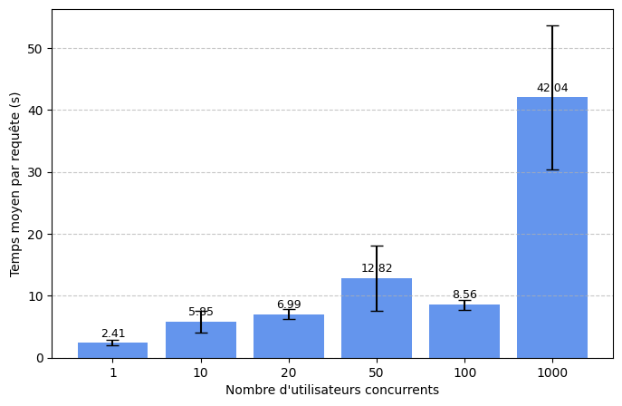
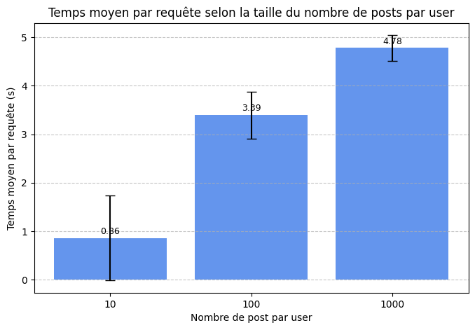
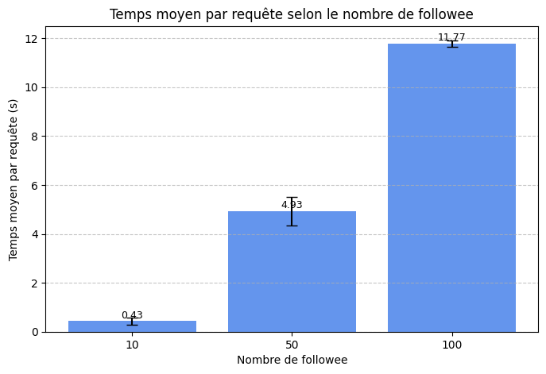

# Projet DMC

**Auteur :** BraKann
**Date :** 2025-11-21

## 1. Création du projet

* Créer un projet Google Cloud Platform.
* Créer un projet GitHub.
* Créer un Codespace et cloner le projet : [https://github.com/momo54/massive-gcp](https://github.com/momo54/massive-gcp)

## 2. Installation des dépendances

```bash
pip install -r requirements.txt
```

## 3. Configuration GCP

```bash
gcloud config set project <ton-projet-id>
gcloud app create --region=europe-west1
gcloud init
gcloud config set project <ton-project-id>
# Si problème de connexion
gcloud auth login
```

## 4. Déploiement de l'application

```bash
gcloud app deploy
```

## 5. Test de seed.py

* Test rapide :

```bash
python seed.py --users 5 --posts 1 --follows-min 1 --follows-max 3
```

## 5. Test de seed.py
* Initialisation complète :

```bash
python seed.py --users 1000 --posts 50 --follows-min 20 --follows-max 20
```

* Exemple de sortie terminal pour 1000 utilisateurs :

```console
[Seed] Utilisateurs ciblés: ['user1', 'user2', ..., 'user1000']
[Seed] Nouveaux utilisateurs créés: 1000
[Seed] Relations de suivi ajustées.
/workspaces/ProjectDMC/scripts/seed.py:76: DeprecationWarning: datetime.datetime.utcnow() is deprecated
[Seed] Posts créés: 50
[Seed] Terminé.
```

## 6. Passage à l’échelle sur la charge 

### 6.1 Test initial avec ApacheBench (ab)

```console
ab -n 100 -c 1 https://projetdmc.ew.r.appspot.com/timeline?user_id=1
Failed requests: 50
Requests per second: 1.60 [#/sec] (mean)
Time per request: 626.388 ms (mean)
```

> Remarque : beaucoup de requêtes échouent à forte concurrence.

### 6.2 1er essai avec `ab` et n = 1

```bash
ab -n 1 -c 1 https://projetdmc.ew.r.appspot.com/timeline?user_id=1le
ab -n 1 -c 10 https://projetdmc.ew.r.appspot.com/timeline?user_id=1le
ab -n 1 -c 20 https://projetdmc.ew.r.appspot.com/timeline?user_id=1le
ab -n 1 -c 50 https://projetdmc.ew.r.appspot.com/timeline?user_id=1le
ab -n 1 -c 100 https://projetdmc.ew.r.appspot.com/timeline?user_id=1le
ab -n 1 -c 1000 https://projetdmc.ew.r.appspot.com/timeline?user_id=1le
```

> Remarque : mauvaise configuration car `n = 1`.

### 6.3 2ème essai avec `ab` et n = 200

| PARAM | AVG_TIME | RUN | FAILED |
| ----- | -------- | --- | ------ |
| 1     | 605.26   | 1   | 104    |
| 1     | 602.015  | 2   | 104    |
| 1     | 581.736  | 3   | 108    |
| 10    | 1330.511 | 1   | 73     |
| 10    | 1182.568 | 2   | 94     |
| 10    | 1338.48  | 3   | 89     |
| 20    | 1478.109 | 1   | 171    |
| 20    | 1437.534 | 2   | 143    |
| 20    | 1302.455 | 3   | 164    |
| 50    | 1754.616 | 1   | 124    |
| 50    | 2112.851 | 2   | 150    |
| 50    | 2154.022 | 3   | 160    |
| 100   | 4127.676 | 1   | 156    |
| 100   | 3252.945 | 2   | 186    |
| 100   | 2983.528 | 3   | 193    |
| 1000  | -1       | 1   | 0      |
| 1000  | -1       | 2   | 0      |
| 1000  | -1       | 3   | 0      |

> Remarque : trop de requêtes échouent à chaque fois. Solutions : vider le Datastore, changer `ab` par `hey`, utiliser `-t 0` pour désactiver le timeout.

### 6.4 3ème essai avec `hey` et n = 200

```bash
hey -t 0 -n 200 -c <concurrence> https://projetdmc.ew.r.appspot.com/timeline?user_id=1
```

| PARAM | AVG_TIME | RUN | FAILED |
| ----- | -------- | --- | ------ |
| 1     | 341.9    | 1   | 0      |
| 1     | 387.5    | 2   | 0      |
| 1     | 377.0    | 3   | 0      |
| 10    | 934.5    | 1   | 0      |
| 10    | 847.9    | 2   | 0      |
| 10    | 986.7    | 3   | 0      |
| 20    | 1097.7   | 1   | 0      |
| 20    | 1065.4   | 2   | 0      |
| 20    | 1109.3   | 3   | 0      |
| 50    | 1259.3   | 1   | 0      |
| 50    | 1135.0   | 2   | 0      |
| 50    | 1195.9   | 3   | 0      |
| 100   | 1876.5   | 1   | 0      |
| 100   | 2162.6   | 2   | 0      |
| 100   | 1676.0   | 3   | 0      |
| 1000  | -1       | 1   | 0      |
| 1000  | -1       | 2   | 0      |
| 1000  | -1       | 3   | 0      |

> Remarque : problème pour 1000 concurrents.

### 6.5 4ème essai avec `hey` et n = 500

```bash
hey -t 0 -n 500 -c <concurrence> https://projetdmc.ew.r.appspot.com/timeline?user_id=1
```

| PARAM | AVG_TIME | RUN | FAILED |
| ----- | -------- | --- | ------ |
| 1     | 410.8    | 1   | 0      |
| 1     | 380.4    | 2   | 0      |
| 1     | 372.4    | 3   | 0      |
| 10    | 972.7    | 1   | 0      |
| 10    | 932.5    | 2   | 0      |
| 10    | 993.7    | 3   | 0      |
| 20    | 1142.5   | 1   | 0      |
| 20    | 1352.7   | 2   | 0      |
| 20    | 1325.5   | 3   | 0      |
| 50    | 1870.3   | 1   | 0      |
| 50    | 1604.8   | 2   | 0      |
| 50    | 2033.5   | 3   | 0      |
| 100   | 2602.1   | 1   | 0      |
| 100   | 2126.8   | 2   | 0      |
| 100   | 1719.9   | 3   | 0      |
| 1000  | -1       | 1   | 0      |
| 1000  | -1       | 2   | 0      |
| 1000  | -1       | 3   | 0      |

> Remarque : Encore un problème pour 1000 concurrents.

### 6.6 5ème essai avec `hey` et n = c (concluant)

```bash
hey -t 0 -n <concurrence> -c <concurrence> https://projetdmc.ew.r.appspot.com/timeline?user_id=1
```

> Exemple de sorties extraites du CSV `conc.csv` :

| PARAM | AVG_TIME (ms) | RUN | FAILED |
| ----- | ------------- | --- | ------ |
| 1     | 410.8         | 1   | 0      |
| 1     | 380.4         | 2   | 0      |
| 1     | 372.4         | 3   | 0      |
| 10    | 972.7         | 1   | 0      |
| 10    | 932.5         | 2   | 0      |
| 10    | 993.7         | 3   | 0      |
| 20    | 1142.5        | 1   | 0      |
| 20    | 1352.7        | 2   | 0      |
| 20    | 1325.5        | 3   | 0      |
| 50    | 1870.3        | 1   | 0      |
| 50    | 1604.8        | 2   | 0      |
| 50    | 2033.5        | 3   | 0      |
| 100   | 2602.1        | 1   | 0      |
| 100   | 2126.8        | 2   | 0      |
| 100   | 1719.9        | 3   | 0      |
| 1000  | 9288.1        | 1   | 0      |
| 1000  | 14375.6       | 2   | 0      |
| 1000  | 21979.4       | 3   | 0      |

## 7. Nettoyage du Datastore avant test

```python
from google.cloud import datastore

client = datastore.Client()

posts = list(client.query(kind='Post').fetch())
users = list(client.query(kind='User').fetch())

for post in posts:
    client.delete(post.key)
for user in users:
    client.delete(user.key)

print(f"{len(posts)} posts supprimés.")
print(f"{len(users)} users supprimés.")
```

## 8. Analyse des performances

* Temps moyen par requête pour différentes concurrences : 1, 10, 20, 50, 100, 1000.
* 

## 10. Passage à l’échelle sur taille des données

### 10.1 Variation du nombre de posts par utilisateur

* Fixer le nombre de followers à 20.
* Faire varier le nombre de posts : 10, 100, 1000.

**Nettoyage du Datastore :**

```bash
python deleteDS.py
```

**Repeuplement :**

```bash
python seed.py --users 21 --posts 1000 --follows-min 20 --follows-max 20
```

**Script de benchmark :**

```python
import subprocess
import csv
import re

URL = "https://projetdmc.ew.r.appspot.com/api/timeline?user=user1"
OUTPUT_FILE = "../out/post.csv"
POST_LEVELS = [10, 100, 1000]
N_REQUESTS = 200
CONCURRENCY = 50

def run_hey(n, c):
    cmd = ["hey", "-t", "0", "-n", str(n), "-c", str(c), URL]
    result = subprocess.run(cmd, capture_output=True, text=True)
    out = result.stdout
    match_time = re.search(r"Average:\s+([\d\.]+)\s*(ms|s|µs)", out)
    avg = float(match_time.group(1)) * (1000 if match_time.group(2) == "s" else 1) if match_time else -1
    match_fail = re.search(r"(\d+)\s+failed", out)
    failed = int(match_fail.group(1)) if match_fail else 0
    return avg, failed

with open(OUTPUT_FILE, "w", newline="") as f:
    writer = csv.writer(f)
    writer.writerow(["POSTS_PER_USER", "AVG_TIME", "RUN", "FAILED"])
    for posts in POST_LEVELS:
        for run in range(1, 4):
            avg, failed = run_hey(N_REQUESTS, CONCURRENCY)
            writer.writerow([posts, avg, run, failed])
```

**Exemple de résultats :**

| POSTS_PER_USER | AVG_TIME (ms) | RUN | FAILED |
| -------------- | ------------- | --- | ------ |
| 10             | 1843.7        | 1   | 0      |
| 10             | 1408.8        | 2   | 0      |
| 10             | 2008.2        | 3   | 0      |
| 100            | 1703.3        | 1   | 0      |
| 100            | 1354.3        | 2   | 0      |
| 100            | 1661.0        | 3   | 0      |
| 1000           | 1646.0        | 1   | 0      |
| 1000           | 2188.0        | 2   | 0      |
| 1000           | 1425.7        | 3   | 0      |



---

### 10.2 Variation du nombre de followee

* Fixer le nombre de posts par utilisateur à 100.
* Faire varier le nombre de followee : 10, 50, 100.

**Nettoyage du Datastore :**

```bash
python deleteDS.py
```

**Repeuplement :**

```bash
python seed.py --users 101 --posts 100 --follows-min 100 --follows-max 100
```

**Script de benchmark :**

```python
import subprocess
import csv
import re

URL = "https://projetdmc.ew.r.appspot.com/api/timeline?user=user1"
OUTPUT_FILE = "../out/fanout.csv"
FANOUT_LEVELS = [10, 50, 100]
N_REQUESTS = 200
CONCURRENCY = 50

def run_hey(n, c):
    cmd = ["hey", "-t", "0", "-n", str(n), "-c", str(c), URL]
    result = subprocess.run(cmd, capture_output=True, text=True)
    out = result.stdout
    match_time = re.search(r"Average:\s+([\d\.]+)\s*(ms|s|µs)", out)
    avg = float(match_time.group(1)) * (1000 if match_time.group(2) == "s" else 1) if match_time else -1
    match_fail = re.search(r"(\d+)\s+failed", out)
    failed = int(match_fail.group(1)) if match_fail else 0
    return avg, failed

with open(OUTPUT_FILE, "w", newline="") as f:
    writer = csv.writer(f)
    writer.writerow(["FANOUT", "AVG_TIME", "RUN", "FAILED"])
    for fanout in FANOUT_LEVELS:
        for run in range(1, 3):
            avg, failed = run_hey(N_REQUESTS, CONCURRENCY)
            writer.writerow([fanout, avg, run, failed])
```

**Exemple de résultats :**

| FANOUT | AVG_TIME (ms) | RUN | FAILED |
| ------ | ------------- | --- | ------ |
| 10     | 1688.4        | 1   | 0      |
| 10     | 1315.8        | 2   | 0      |
| 50     | 1475.0        | 1   | 0      |
| 50     | 1441.9        | 2   | 0      |
| 100    | 1812.7        | 1   | 0      |
| 100    | 1658.2        | 2   | 0      |




## 11. Création de barplots

```python
import pandas as pd
import matplotlib.pyplot as plt

# Lecture des données
#data = pd.read_csv("../out/conc.csv")  
#data = pd.read_csv("../out/post.csv")
data = pd.read_csv("../out/fanout.csv")  

# Convertir le temps en float et en secondes (si les temps sont en ms)
data['AVG_TIME'] = data['AVG_TIME'].astype(float) / 1000  # division par 1000 pour passer en secondes

# Calculer la moyenne et la variance pour chaque PARAM
#stats = data.groupby('PARAM')['AVG_TIME'].agg(['mean', 'std']).reset_index()
#stats = data.groupby('POSTS_PER_USER')['AVG_TIME'].agg(['mean', 'std']).reset_index()
stats = data.groupby('FANOUT')['AVG_TIME'].agg(['mean', 'std']).reset_index()

# Création du barplot
plt.figure(figsize=(8,5))
#bars = plt.bar(stats['PARAM'].astype(str), stats['mean'], yerr=stats['std'], capsize=5, color='cornflowerblue')
#bars = plt.bar(stats['POSTS_PER_USER'].astype(str), stats['mean'], yerr=stats['std'], capsize=5, color='cornflowerblue')
bars = plt.bar(stats['FANOUT'].astype(str), stats['mean'], yerr=stats['std'], capsize=5, color='cornflowerblue')

# Étiquettes et titre
#plt.xlabel("Nombre d'utilisateurs concurrents")
#plt.xlabel("Nombre de post par user")
plt.xlabel("Nombre de followee")
plt.ylabel("Temps moyen par requête (s)")
#plt.title("Temps moyen par requête selon la taille du nombre de posts par user")
plt.title("Temps moyen par requête selon le nombre de followee")
plt.grid(axis='y', linestyle='--', alpha=0.7)

# Affichage des valeurs exactes au-dessus des barres
for bar, mean in zip(bars, stats['mean']):
    plt.text(bar.get_x() + bar.get_width()/2, mean + stats['std'].max()*0.05, f"{mean:.2f}", ha='center', va='bottom', fontsize=9)

# Sauvegarde automatique du barplot
#plt.savefig("../out/barplot_conc.png", bbox_inches='tight')
#plt.savefig("../out/barplot_post.png", bbox_inches='tight')
plt.savefig("../out/barplot_fanout.png", bbox_inches='tight')
print("Barplot sauvegardé dans ../out")

# Afficher le graphique
plt.show()
```

